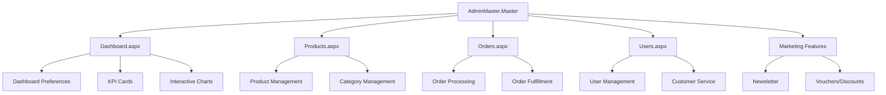

# System Patterns

## Architecture Overview
The Online Pastry Shop application follows a traditional ASP.NET Web Forms architecture with a multi-layered approach:

1. **Presentation Layer**:
   - ASP.NET Web Forms pages (.aspx files)
   - Master pages for layout consistency
   - Client-side scripting with JavaScript

2. **Business Logic Layer**:
   - Code-behind files (.aspx.cs)
   - Utility classes for common operations

3. **Data Access Layer**:
   - Oracle database integration
   - Stored procedures for data operations
   - Connection management utilities

## Key Design Patterns

### Page Controller Pattern
Each web form (`.aspx`) has a corresponding code-behind file (`.aspx.cs`) that handles:
- User interactions
- Business logic execution
- Data binding to UI elements
- Response generation

### Master Page Pattern
- `AdminMaster.Master` provides consistent layout for admin pages
- Customer-facing pages use a separate master page for storefront consistency

### Repository Pattern (Modified)
- Data access occurs through stored procedures 
- Oracle parameters are used for parameterized queries
- Database connections are managed through connection strings

### Badge Counter Pattern
- Notification counters for pending actions (orders, messages, etc.)
- Dynamically updated counts on the admin sidebar

### Dashboard Component Pattern
- Modular dashboard widgets for different metrics
- User-customizable components with persistence
- Real-time data updates through AJAX

## Database Approach

### Table Design
- Core business entities (USERS, PRODUCTS, ORDERS, etc.)
- Relationship tables for many-to-many relationships
- Support tables for features like wishlists, ratings, etc.

### Stored Procedures
- Parameterized procedures for all CRUD operations
- Complex queries encapsulated in procedures
- Return values and output parameters for complex operations

### Triggers and Sequences
- Automated ID generation using sequences
- Timestamp maintenance with triggers
- Consistency maintained through constraints

## Component Relationships

## Customization Approach
- User preferences stored in database tables
- Client-side state managed with ViewState and Session
- Server-side user settings loaded on page initialization
- AJAX for dynamic updates without full page reloads 